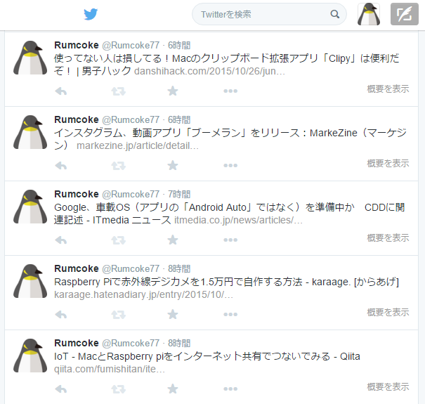

# NewsCroller

This application is a lightweight news crawler bot that does not use a database.
It will use Twitter as a notification destination.
It has confirmed the operation in Raspbian operating at Raspberry pi.

# Usage
It will set up a CSV format file that describes the NewsCroller.sh and crawled away.
It is registered in the crontab.
Described example , please refer to the target_list_hatebu.txt.
~~~
0 * * * * /home/hoge/NewsCroller.sh /home/hoge/target_list_hatebu.txt > /dev/null 2>&
~~~

# Config
###slado_replace.sh
You can change the header of the message.
~~~
MSG_BOT='[自動ツイート]'
~~~

It will hold the remark was history number.
Frequency of performing the remark that overlap to be big to will drop,but the performance will suffer.
~~~
COUNT_HIST='30'
~~~

It will specify the area of ​​the history file.
~~~
TMP_DIR="/tmp/"
~~~

###tw command
Please keep in finished the installation and certification of tw command in advance.
~~~
# apt-get install ruby && gem install tw
~~~

# License
This software is released under the MIT License, see LICENSE.
